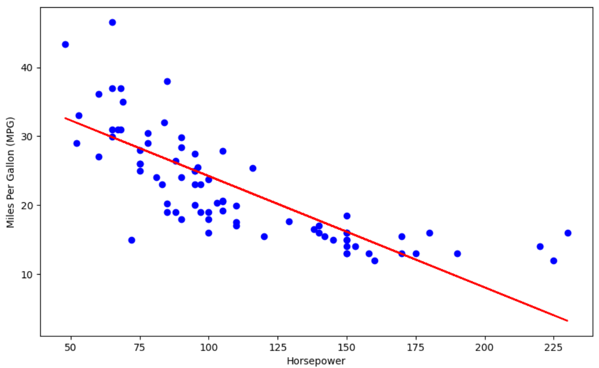
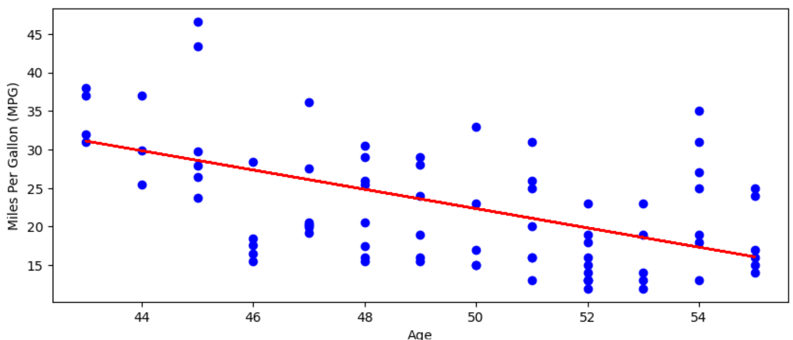

## Overview

Simple Linear Regression is the most basic form of regression analysis used in statistics and machine learning. It models the relationship between two variables:

Independent variable (X): Also known as the predictor or input variable.

Dependent variable (Y): Also known as the output or response variable.

The objective of simple linear regression is to find the line of best fit that best represents the relationship between the two variables.

__Equation of the Line__

The linear relationship is modeled using the equation:

y = mx + b

Where 
- y  is the predicted value (dependent variable)
- x is the input value (independent variable)
- m is the slope of the line (the change in Y for a unit change in x)
- b is the intercept (value of Y when X = 0)

### How Does Linear Regression Find the Best-Fit Line?

The primary goal of the linear regression algorithm is to determine the optimal values of the model parameters:

  - m (intercept)
  - b (slope)

These values define the line of best fit, which represents the most accurate approximation of the relationship between the independent variable x and the dependent variable y

__What Is the Best-Fit Line?__

The best-fit line is a straight line that best represents the data points in a scatter plot. It is the line that minimizes the error between the actual observed values and the predicted values generated by the regression model.

Mathematically, this line is obtained by minimizing the Residual Sum of Squares (RSS), which measures the total deviation of predicted values from the actual values.

## Cost Function for Linear Regression

In linear regression, the **cost function** is used to determine how well the model's predictions match the actual data. The goal is to find the optimal values for the model parameters (`m` for slope and `b` for intercept) that define the **best-fit line**.

__Mean Squared Error (MSE)__

The most commonly used cost function in linear regression is the **Mean Squared Error (MSE)**. It measures the average of the squared differences between the predicted values and the actual values:

MSE = (1/n) * Σ (yᵢ - ŷᵢ)²

Where:
- `n` is the number of data points,
- `yᵢ` is the actual observed value,
- `ŷᵢ = m * xᵢ + b` is the predicted value,
- `xᵢ` is the input value of the independent variable.

MSE gives a sense of how far off the predictions are from the actual data points. The lower the MSE, the better the model.

__When to Use MSE (Mean Squared Error)__

- During model training (as a loss function)
- Comparing models: smaller MSE = better predictions
- Evaluating outliers or errors — it's sensitive to large errors

### Gradient Descent for Linear Regression

To minimize the MSE and find the best values of `m` and `b`, we use an optimization technique called **Gradient Descent**.

__What is Gradient Descent?__

**Gradient Descent** is an iterative optimization algorithm that helps find the minimum of a function—in this case, the cost function (MSE). It does so by updating the parameters (`m` and `b`) in the opposite direction of the gradient (slope) of the cost function with respect to those parameters.

### How it Works

1. Start with initial guesses for `m` and `b` (often random).
2. Compute the cost function (MSE).
3. Calculate the gradients (partial derivatives) of the cost function with respect to `m` and `b`.
4. Update the values of `m` and `b` using these gradients:

### Understanding Residuals (Random Error)

In linear regression, a **residual** (also called random error) is the difference between the observed value of the dependent variable and the value predicted by the regression model.

The residual for the *i-th* observation is given by:

residualᵢ = yᵢ - ŷᵢ

Where:
- `yᵢ` is the actual observed value,
- `ŷᵢ` is the predicted value,
- The predicted value is computed as:

ŷᵢ = m * xᵢ + b

Here:
- `m` is the **slope** of the regression line,
- `b` is the **intercept** of the regression line,
- `xᵢ` is the independent variable input for the *i-th* data point.

Residuals help in identifying how far off the predictions are from the actual data, and are critical in evaluating model accuracy.

__Minimizing Error: Residual Sum of Squares (RSS)__

To determine the best-fit line in linear regression, the model aims to **minimize the total residual error** across all data points. This is done using the **Residual Sum of Squares (RSS)**, which is the sum of the squared residuals for all observations.

The RSS is calculated as:

RSS = Σ (yᵢ - ŷᵢ)²
    = Σ (yᵢ - (m * xᵢ + b))²

Where:
- `RSS` is the total residual sum of squares,
- `yᵢ` is the actual observed value,
- `xᵢ` is the independent variable value,
- `m` is the slope,
- `b` is the intercept.

By minimizing the RSS, the linear regression algorithm finds the values of `m` and `b` that make the best-fit line align as closely as possible to the data points.

This method of minimizing squared errors is known as the **Least Squares Method** and is a fundamental approach in linear regression.

## R-squared (R²) and Adjusted R-squared (R²)

When performing regression analysis, it's important to evaluate the goodness of fit of your model. The most common metric for this is R squared (R²), which measures how well your regression model captures the variance in the underlying data. R² is expressed between 0 and 1 (or 0% to 100%). In general, a higher R-squared value indicates a better fit between the model and the data

__R-squared Formula__

The R-squared value is calculated using the formula:

$$R^2 = 1 - \frac{\text{RSS}}{\text{TSS}}$$
  
Where:
- __RSS (Residual Sum of Squares)__ Measures the total squared difference between the actual and predicted values.: $ \sum (y_i - \hat{y}_i)^2 $
- __TSS (Total Sum of Squares)__ Measures the total variance in the actual values from their mean: $ \sum (y_i - \bar{y})^2 $

- $y_i$ is the actual value,
- $\hat{y}_i$ is the predicted value,
- $\bar{y}$ is the mean of actual values.

However, __R² has a limitation__: in multiple regression, adding new X variables will always increase the R² value, potentially leading to __overfitting__. Overfitted models are not ideal for predictive analytics because they may not generalize well to new data.

To address this issue, __Adjusted R squared (Adjusted R²)__ is used. Adjusted R² is derived from R² but includes a penalty for adding irrelevant variables. It uses statistical testing to determine the relevance of new X variables in the model. Adjusted R² increases if irrelevant variables are removed, making it a more reliable metric for evaluating multiple regression models.

The Adjusted R squared (Adjusted R²) value is calculated using the formula:

$$
\text{RMSE} = \sqrt{\frac{1}{n} \sum_{i=1}^{n} (y_i - \hat{y}_i)^2}
$$

Where:
- $y_i$ is the actual value,
- $\hat{y}_i$ is the predicted value,
- $n$ is the number of data points.

**RMSE** gives an error value in the same units as the target variable, making it easier to interpret. A lower RMSE means better predictive accuracy. RMSE is especially useful when you want to understand the typical size of prediction errors in your model.

__When to Use R-squared (R²)__

- Explain how well your model fits the data
- During model reporting or explanation
- To measure how much of the target's variability is captured by your model
- When comparing different models on the same dataset

__Which One (MSE vs R²) to Use When?__

| Task                              | Use MSE? | Use R²? |
| --------------------------------- | -------- | ------- |
| Training the model                | ✅ Yes    | ❌ No    |
| Measuring raw prediction accuracy | ✅ Yes    | ❌ No    |
| Comparing model fit (scale-free)  | ❌ No     | ✅ Yes   |
| Reporting or explaining results   | ❌ Maybe  | ✅ Yes   |
| Hyperparameter tuning             | ✅ Yes    | ❌ No    |


## Step 1: Import Required Libraries
Before starting, we need to import the tools we'll use:

```python
import pandas as pd            # for working with data
import numpy as np             # for numerical calculations
import matplotlib.pyplot as plt  # for making graphs
from sklearn.linear_model import LinearRegression  # the regression model
from sklearn.model_selection import train_test_split  # for splitting the data
from sklearn.metrics import r2_score  # to measure model performance
```

## Step 2: Load the Dataset
We'll use a file called auto-mpg-cleaned.csv that contains car details.

```python
am_df = pd.read_csv('data/auto-mpg-cleaned.csv')  # load the dataset
am_df.sample(5)  # show a few random rows from the dataset
```

### Sample Data

|    | mpg  | cylinders | displacement | horsepower | weight | acceleration | age |
|----|------|-----------|--------------|------------|--------|--------------|-----|
|277 | 36.0 | 4         | 107.0        | 75.0       | 2205   | 14.5         | 43  |
|4   | 13.0 | 8         | 400.0        | 170.0      | 4746   | 12.0         | 54  |
|129 | 31.8 | 4         | 85.0         | 65.0       | 2020   | 19.2         | 46  |
|374 | 13.0 | 8         | 360.0        | 170.0      | 4654   | 13.0         | 52  |
|224 | 17.5 | 8         | 318.0        | 140.0      | 4080   | 13.7         | 47  |

This table shows a few random rows from the dataset.

__Features in the file__:

cylinders, displacement, horsepower, weight, acceleration, age

Target variable (what we want to predict):

mpg (miles per gallon)

## Step 3: Split the Data

We need to split the data into two parts:

Training data (80%) — used to teach the model

Test data (20%) — used to check how well the model learned

```python
X = am_df[['horsepower']]  # independent variable (input)
Y = am_df['mpg']  # dependent variable (output) 
x_train, x_test, y_train, y_test = train_test_split(X, Y, test_size=0.2, random_state=42)  # split the data into training and testing sets
```

## Step 4: Train the Model (Using Horsepower)

We'll use the Linear Regression model to learn the pattern between horsepower and MPG.

```python
model = LinearRegression().fit(x_train, y_train)  # create a linear regression model
```

## Step 5: Check Model Performance
Now let's see how good the model is using R-squared (R²), which tells us how much of the variation in MPG is explained by horsepower.

```python
print(f"Training Score: {model.score(x_train, y_train)}")  # print the model coefficients and intercept
```

Training Score: 0.6102025443737438

```python
y_pred = model.predict(x_test)  # make predictions on the test set
print(f"R^2 Score: {r2_score(y_test, y_pred)}")  # print the R^2 score
```
R^2 Score: 0.577738848858589

## Step 6: Visualize the Results

Let's draw a graph of the test data with the predicted line

```python
fig, ax = plt.subplots(figsize=(10, 6))  # create a figure and axis for the plot
plt.scatter(x_test, y_test, color='blue', label='Actual')  # plot the actual data points
plt.plot(x_test, y_pred, color='red', label='Predicted')  # plot the predicted data points
plt.xlabel('Horsepower')  # label for the x-axis
plt.ylabel('Miles Per Gallon (MPG)')  # label for the y-axis    
plt.show()  # display the plot
```



## Step 7: Try Another Feature (Age of Car)
We can now try using age instead of horsepower to predict MPG.

```python
X = am_df[['age']]  # independent variable (input)
Y = am_df['mpg']  # dependent variable (output) 
x_train, x_test, y_train, y_test = train_test_split(X, Y, test_size=0.2, random_state=42)  # split the data into training and testing sets
model = LinearRegression().fit(x_train, y_train)  # create a linear regression model
print(f"Training Score: {model.score(x_train, y_train)}")  # print the model coefficients and intercept
y_pred = model.predict(x_test)  # make predictions on the test set
print(f"R^2 Score: {r2_score(y_test, y_pred)}")  # print the R^2 score
```

Training Score: 0.3574370422288594
R^2 Score: 0.23910271230138802

__Visualize Age vs MPG__



### Model Comparison

| Feature    | Training Score | Test Score | What It Means                        |
| ---------- | -------------- | ---------- | ------------------------------------ |
| Horsepower | ~0.61          | ~0.58      | Good predictor of MPG                |
| Age        | ~0.36          | ~0.24      | Weaker predictor — not very reliable |

Horsepower is a much stronger predictor of miles per gallon (MPG) than age in this dataset. The higher scores indicate the model explains more of the variation in MPG when using horsepower.

## Final Notes:

- Linear Regression helps find the relationship between one feature and a target.
- R² Score tells how good the model is (closer to 1 is better).
- Graphs help visualize model predictions and actual values.
