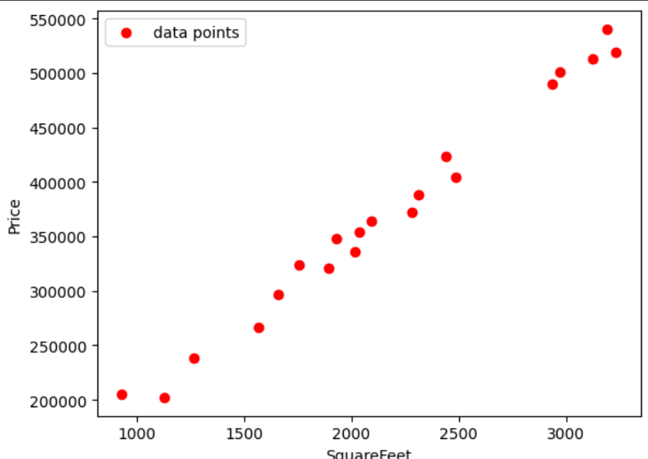
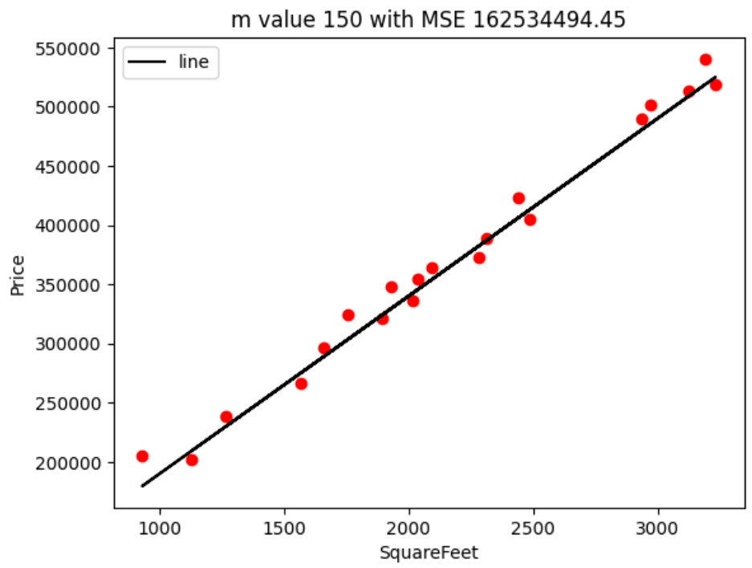

# Understanding Cost Function in Regression

This document explains the concept of cost function in regression using Python code examples. 

---

## 1. What is a Cost Function?

A **cost function** measures how well a regression model fits the data. In linear regression, the most common cost function is **Mean Squared Error (MSE)**, which calculates the average squared difference between predicted and actual values.

---

## 2. Generating Sample Data

We simulate house prices based on square footage, adding random noise to mimic real-world data.

```python
import numpy as np
import pandas as pd

np.random.seed(42)
house_sqft = np.random.randint(800, 3500, 20)
house_price = 50000 + house_sqft * 150 + np.random.randint(-20000, 20000, 20)

df = pd.DataFrame({
    'SquareFeet': house_sqft,
    'Price': house_price
})
```

---

## 3. Visualizing the Data

Plot the data points to see the relationship between square footage and price.

```python
import matplotlib.pyplot as plt

plt.scatter(df.SquareFeet, df.Price, color='red', label='data points')
plt.xlabel('SquareFeet')
plt.ylabel('Price')
plt.legend()
plt.show()
```


---

## 4. Exploring Different Regression Lines

Change the slope (`m`) and intercept (`b`) to see how the regression line fits the data and how the cost function (MSE) changes.

```python
from sklearn.metrics import mean_squared_error as mse

m = 50
b = 20000
predicted_val = [df.SquareFeet[i]*m + b for i in range(len(df))]
plt.scatter(df.SquareFeet, df.Price, color='red')
plt.plot(df.SquareFeet, predicted_val, color='black', label='line')
plt.xlabel('SquareFeet')
plt.ylabel('Price')
plt.legend()
MSE = mse(df.Price, predicted_val)
plt.title(f"m value {m} with MSE {MSE}")
plt.show()
```



---

## 5. Visualizing the Cost Function

Plot the MSE for different slope values to show how the cost function varies. The minimum point on the curve indicates the optimal slope for the best-fit line.

```python
def calculate_mse(m, df, b=40000):
    predictions = df['SquareFeet'] * m + b
    return mse(df['Price'], predictions)

m_values = np.arange(40, 251)
mse_values = [calculate_mse(m_val, df) for m_val in m_values]

plt.figure(figsize=(8, 5))
plt.plot(m_values, mse_values, marker='o')
plt.xlabel('Slope (m)')
plt.ylabel('Mean Squared Error')
plt.title('MSE vs Slope (m)')
plt.grid(True)
plt.show()
```


---

## 6. Summary

- The **cost function** quantifies the error between predicted and actual values.
- Minimizing the cost function helps find the best-fit regression line.
- Visualizing the cost function helps understand model optimization.

For more details, visit [Analytics Vidhya: Introduction to Cost Function](https://www.analyticsvidhya.com/blog/2021/03/data-science-101-introduction-to-cost-function/).
